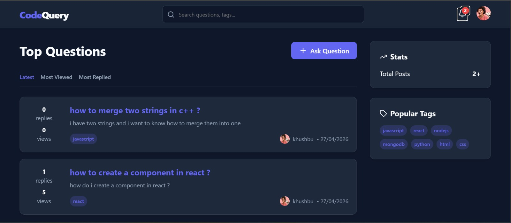
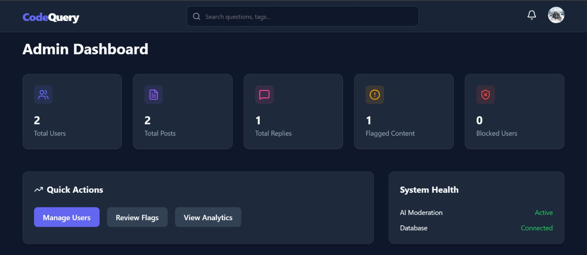

# CodeQuery - Developer Q&A Platform

A full-stack MERN Developer Q&A platform with AI-powered moderation and automated abuse control, designed to simulate real-world community systems like Stack Overflow.

## Demo

Live URL: https://codequery-app.netlify.app/

## Preview

### User Dashboard



### Admin Dashboard



## Features
- **Authentication**: JWT-based with bcrypt password hashing.
- **AI Moderation System**: Server-side content analysis using Groq LLM to detect abuse, spam, and harassment.
- **Strike System**: Automated enforcement — users are permanently blocked after 3 violations.
- **Rate Limiting**: Custom request throttling (login + post/reply) using express-rate-limit to prevent abuse and brute-force attacks.
- **Admin Panel**: Full moderation dashboard with analytics, flagged content review, user control (block/unblock), and platform insights.
- **Notifications**: In-app notifications for replies and moderation warnings.
- **Search**: Full-text search across questions and tags.

## Tech Stack
- **Frontend**: React.js, Vite, Lucide React, Framer Motion.
- **Backend**: Node.js, Express.js, MongoDB Atlas, Mongoose.
- **AI**: Groq SDK.
- **Security**: JWT, bcrypt, express-rate-limit.

## Setup Instructions

### 1. Backend Setup
1. Navigate to the `backend` directory:
   ```bash
   cd backend
   ```
2. Install dependencies:
   ```bash
   npm install
   ```
3. Create a `.env` file and fill in your credentials:
   - `MONGO_URI`: Your MongoDB connection string.
   - `JWT_SECRET`: A secret key for JWT.
   - `GROQ_API_KEY`: Your Groq API key (get it from [console.groq.com](https://console.groq.com)).
   - `CLOUDINARY_CLOUD_NAME`: Your cloudinary cloud name.
   - `CLOUDINARY_API_KEY`: Your cloudinary api key.
   - `CLOUDINARY_API_SECRET`: Your cloudinary api seceret key.
4. Start the server:
   ```bash
   npm start
   ```

### 2. Frontend Setup
1. Navigate to the `frontend` directory:
   ```bash
   cd frontend
   ```
2. Install dependencies:
   ```bash
   npm install
   ```
3. Start the development server:
   ```bash
   npm run dev
   ```

## Admin Access
To access the admin panel, you must manually change the `role` of a user to `admin` in your MongoDB database.

## Architecture
- **Backend**: Layered architecture (Controllers, Routes, Models, Services, Middleware).
- **Frontend**: Component-based with React Context for state management.
